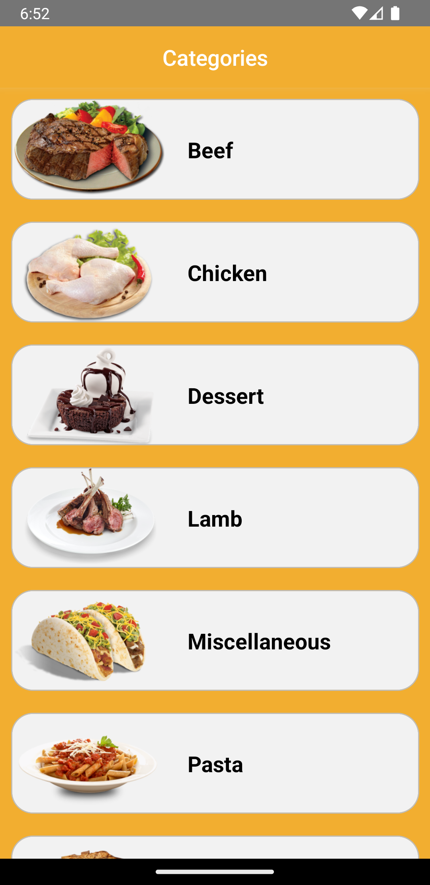
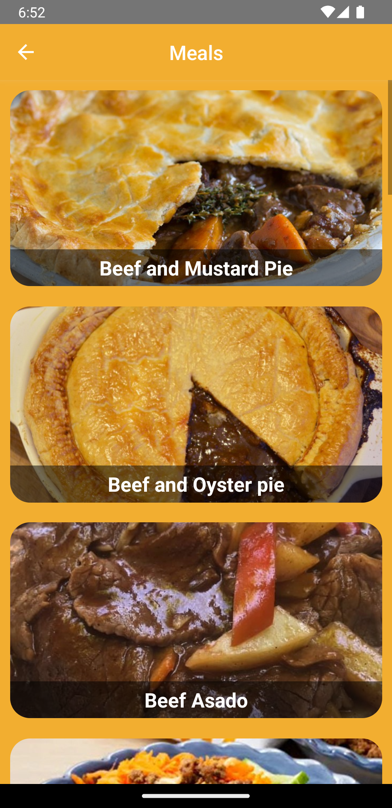
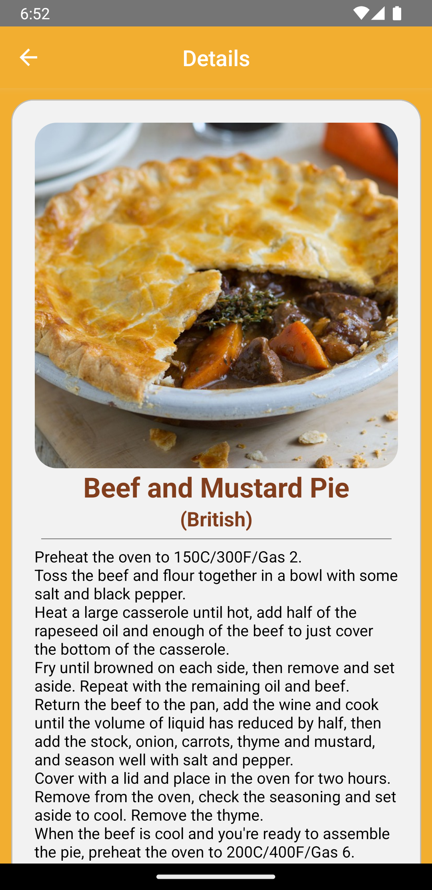
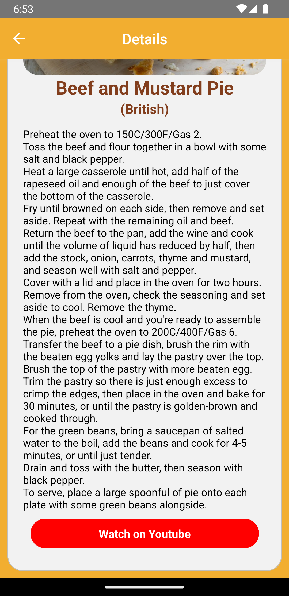

# Recipes
Recipes app coded with React Native

   


## Tools & Resources
- [TheMealDB](https://www.themealdb.com/api.php) for api
- [Lottie](https://github.com/lottie-react-native/lottie-react-native) for animation
- [React Navigation](https://reactnavigation.org/) for page hierarchy
- [.env](https://github.com/motdotla/dotenv) for Storing configuration in the environment separate from code
- [Axios](https://github.com/axios/axios) for data fetching.


## Installation
- Install [React Native](https://reactnative.dev/docs/getting-started)
- Run on your terminal 'git clone https://github.com/erkinozturk/Recipes.git'
- Run in root directory with terminal 'npm install'
- Run 'npx react-natice run-ios/run-android' when 'npm install' finished


## Usage
After cloning the project, open it in Visual Studio Code.

for Linux:

```
cd Recipes
code .
```


## Contributing
Pull requests are welcome. For major changes, please open an issue first
to discuss what you would like to change.

Please make sure to update tests as appropriate.


## License
[MIT](https://choosealicense.com/licenses/mit/)